# JOBSHEET-7

## TUGAS PRAKTIKUM

### Tugas Praktikum 1 — Toolkit Bash Administrator Pribadi
Konteks riil: seorang administrator sering mengulang perintah yang sama setiap hari. Agar pekerjaan lebih efisien dan konsisten, ia perlu memiliki toolkit Bash pribadi otomatis yang
aktif setiap login.

Instruksi tugas:
1. Tambahkan konfigurasi pada .bashrc untuk:
• menambahkan direktori bin pribadi ke PATH,
• membuat minimal 2 alias yang membantu kerja harian,
• membuat minimal 1 fungsi shell yang berguna untuk administrasi.
2. Pastikan konfigurasi tersebut aktif kembali saat membuka shell login.
3. Buat satu script sederhana di direktori bin pribadi, misalnya script untuk menampilkan ringkasan sistem.
4. Uji dari direktori yang berbeda untuk memastikan script dapat dipanggil tanpa menuliskan path lengkap.
5. Simpan bukti pengujian ke file toolkit-bash-report.txt

Minimal luaran:
• isi blok konfigurasi yang ditambahkan ke .bashrc,
• output echo $PATH,
• output type untuk alias, fungsi, dan script,
• file laporan toolkit-bash-report.txt.

Hasil Praktikum dan Command:
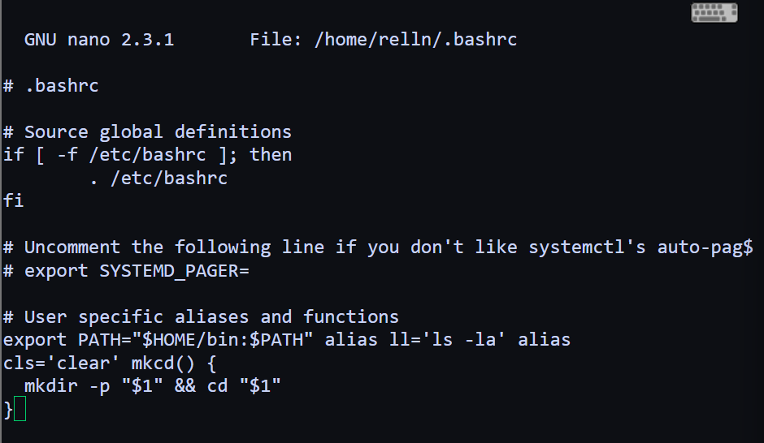

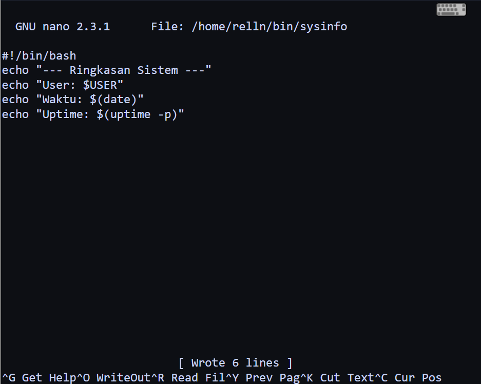
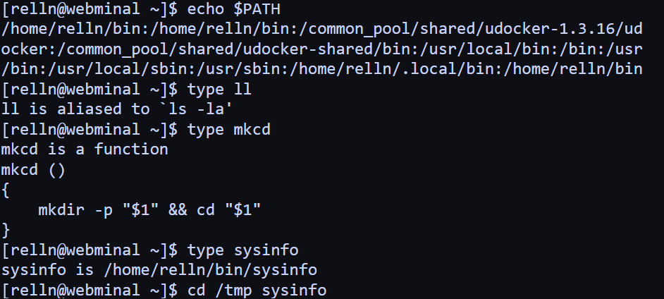
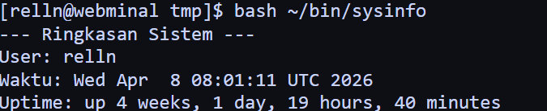
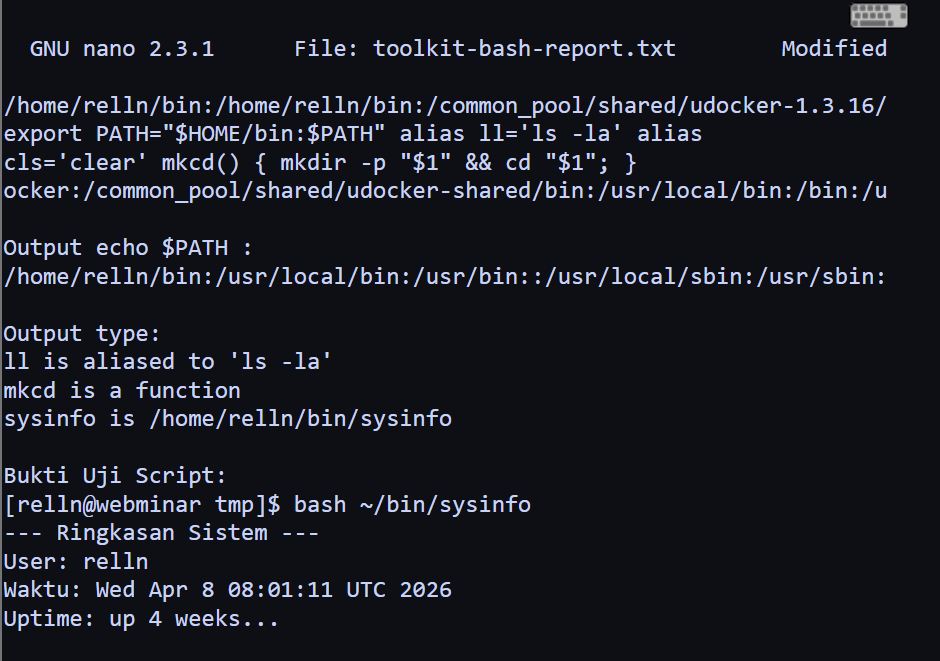

### Tugas Praktikum 2 — Audit File Konfigurasi dan Logging Aman
Konteks riil: saat troubleshooting, administrator sering perlu menginventarisasi file konfigurasi dan memisahkan output normal dari pesan error.

Instruksi tugas:
1. Buat file laporan bernama audit-konfigurasi-$(date +%F).txt.
2. Cari file *.conf di dalam /etc dan simpan hasilnya ke file laporan.
3. Catat jumlah total file konfigurasi yang ditemukan.
4. Jika ada pesan error, simpan ke file terpisah, misalnya audit-error.log.
5. Tampilkan isi laporan ke terminal dan sekaligus simpan menggunakan tee.
6. Tambahkan ringkasan singkat 3–5 baris yang menjelaskan mengapa pemisahan
stdout dan stderr penting dalam audit sistem.

Syarat konsep yang harus muncul:
• redirection >, 2>, atau &>,
• pipeline,
• tee,
• penggunaan variabel atau command substitution.
Minimal luaran:
• file laporan audit,
• file log error,
• perintah yang digunakan,
• analisis singkat hasil audit.

Hasil Praktikum dan Command:
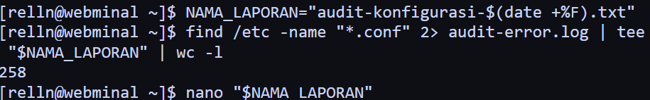
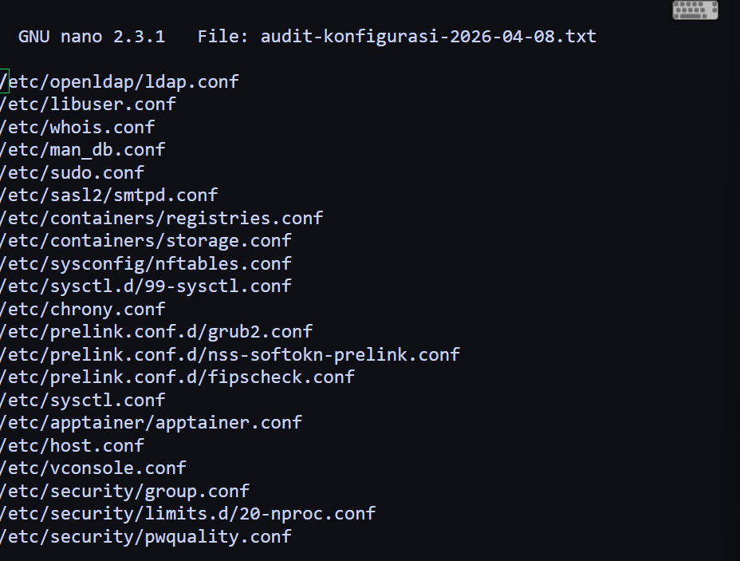
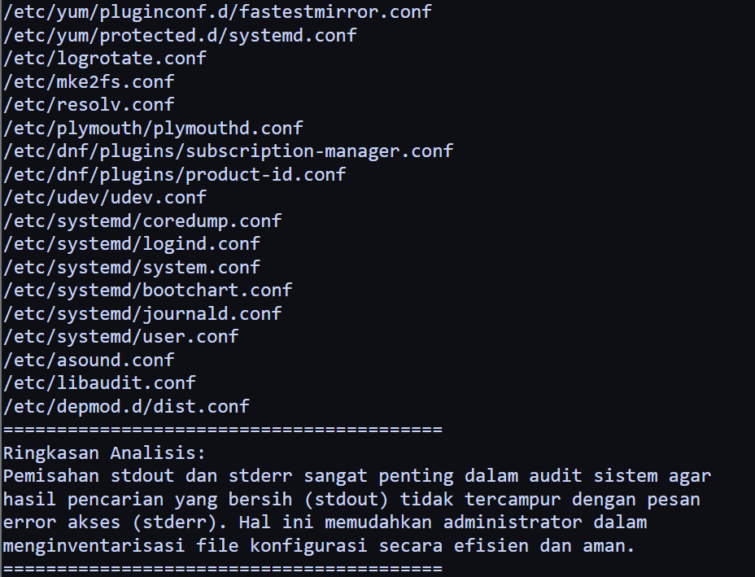
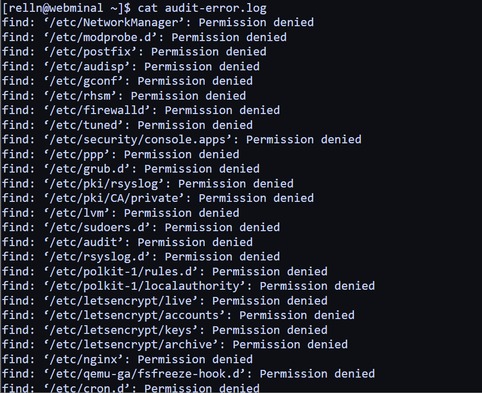
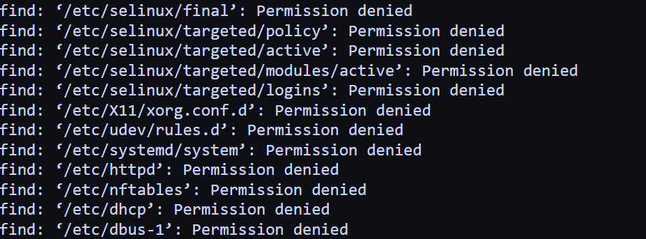

### Tugas Praktikum 3 — Mini Health Check Harian Server
Konteks riil: administrator perlu membuat pemeriksaan cepat (health check) untuk mengetahui kondisi dasar server sebelum dan sesudah maintenance.

Instruksi tugas:
1. Buat script Bash bernama daily-healthcheck pada direktori bin pribadi.
2. Script minimal harus menampilkan:
• tanggal dan waktu,
• hostname,
• user aktif,
• shell aktif,
• uptime,
• penggunaan memori,
• penggunaan filesystem root,
• 10 baris terakhir history command yang relevan dengan pengecekan.
3. Simpan hasil ke file log harian, misalnya healthcheck-$(date +%F).log.
4. Tampilkan hasil ke terminal dan ke file secara bersamaan.
5. Jika Anda menggunakan pipeline dengan tee, cek juga status exit command utama.
Syarat konsep yang harus muncul:
• environment variable,
• PATH,
• alias atau fungsi pendukung,
• history,
• tee,
• penanganan error dasar.

Minimal luaran:
• file script yang executable,
• contoh isi file log hasil eksekusi,
• penjelasan singkat fungsi tiap bagian script.
Jawban Penjelasan Bagian Script:
- LOGFILE=...: Menggunakan command substitution untuk menamai file sesuai tanggal.
- { ... }: Mengelompokkan semua perintah pengecekan agar outputnya bisa dikirim barel-bareng.
- tee "$LOGFILE": Menampilkan hasil di terminal sekaligus menyimpan ke file .log.
- ${PIPESTATUS[0]}: Mengecek apakah perintah utama (pemeriksaan server) berhasil atau tidak, sesuai syarat penanganan error dasar.

Hasil Praktikum dan Command:
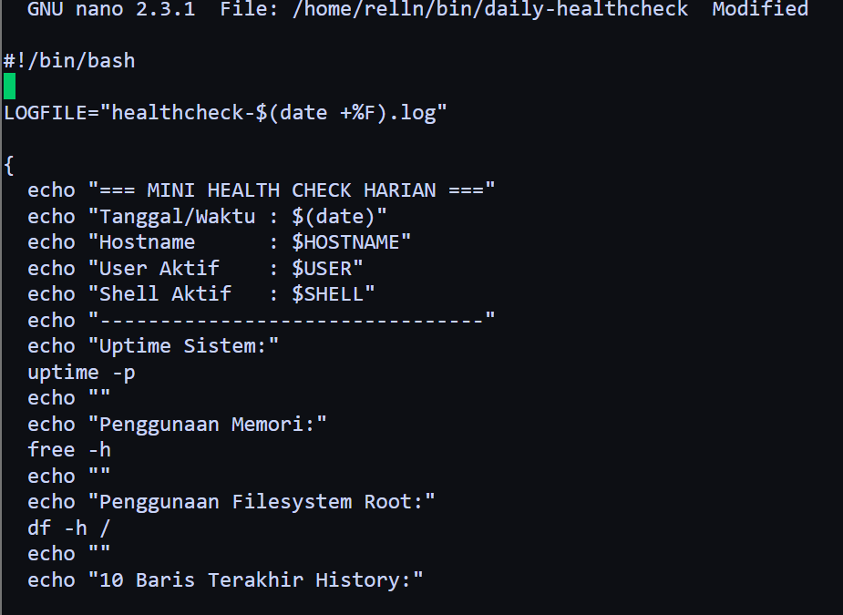
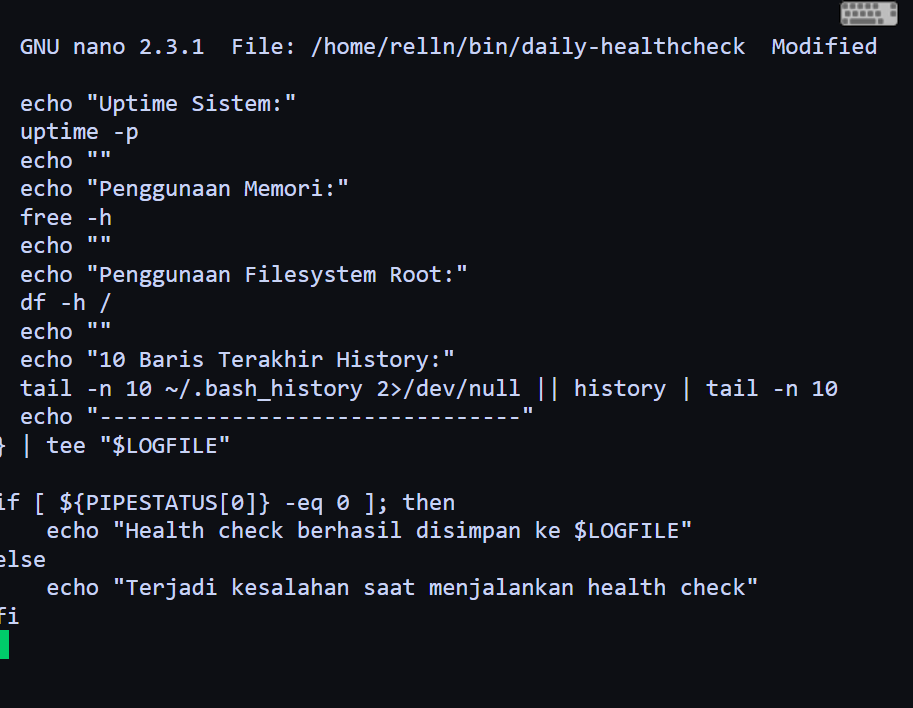
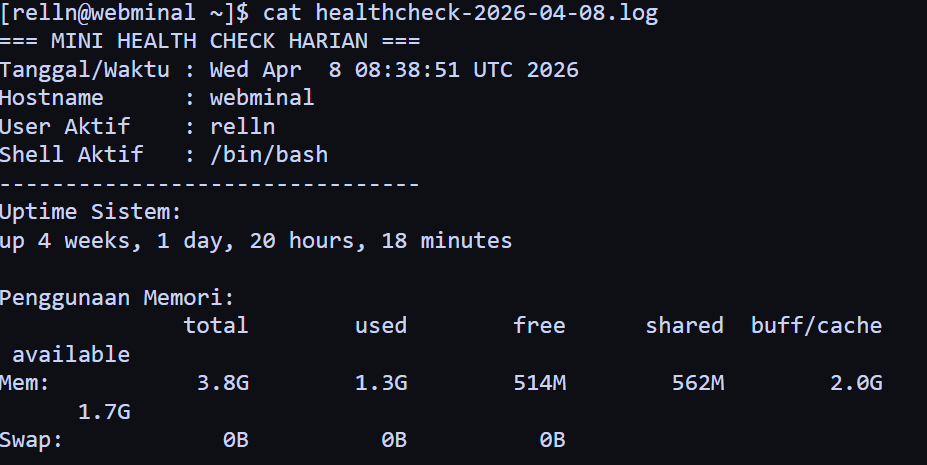

### Tugas Praktikum 4 — Penanganan File dengan Nama Kompleks dan Arsip Aman
Konteks riil: file hasil backup, ekspor, atau laporan sering memiliki nama yang mengandung spasi atau karakter khusus. Administrator harus tetap dapat memproses file-file tersebut tanpa salah target.

Instruksi tugas:
1. Buat minimal 4 file contoh dengan nama yang bervariasi, termasuk:
• nama file yang mengandung spasi,
• nama file yang mengandung tanda kurung siku atau karakter khusus,
• file dengan pola nama serupa untuk diuji dengan wildcard.
2. Tunjukkan perbedaan hasil jika file diakses tanpa quoting dan dengan quoting
yang benar.
3. Lakukan preview wildcard dengan echo sebelum dipakai untuk operasi nyata.
4. Salin file-file tersebut ke direktori backup dengan nama yang aman.
5. Buat arsip tar.gz dari hasil backup.
6. Simpan riwayat perintah yang Anda gunakan ke file riwayat-arsip.txt.
Syarat konsep yang harus muncul:
• single quote, double quote, dan escaping,
• wildcard,
• variabel path,
• history,
• operasi file lanjutan yang aman.

Minimal luaran:
• daftar file awal,
• daftar file hasil backup,
• file arsip tar.gz,
• file riwayat-arsip.txt,
• refleksi singkat tentang pentingnya quoting di Bash.

Hasil Praktikum dan Command:
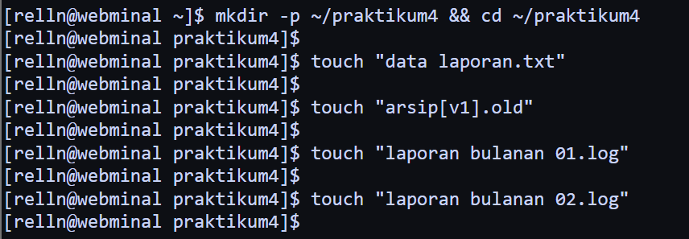
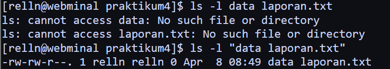
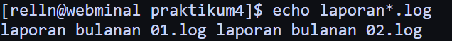
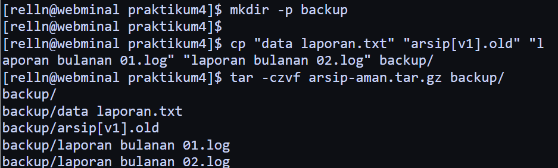
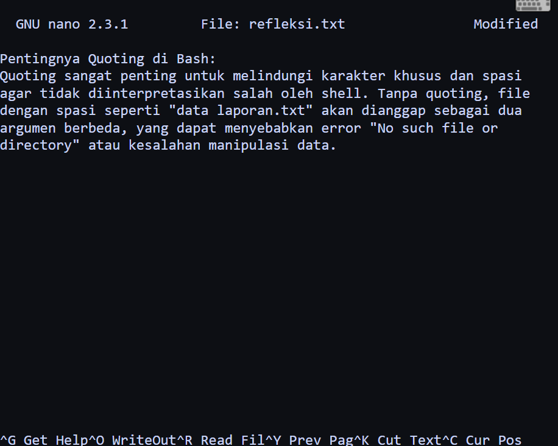
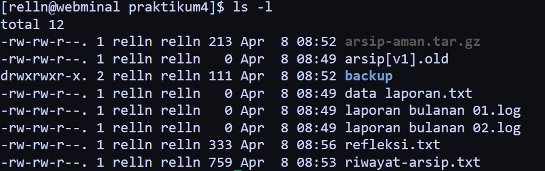
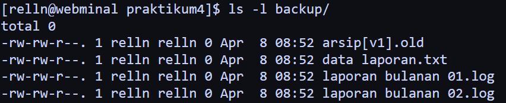
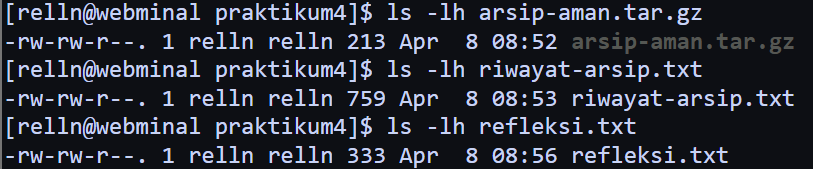
